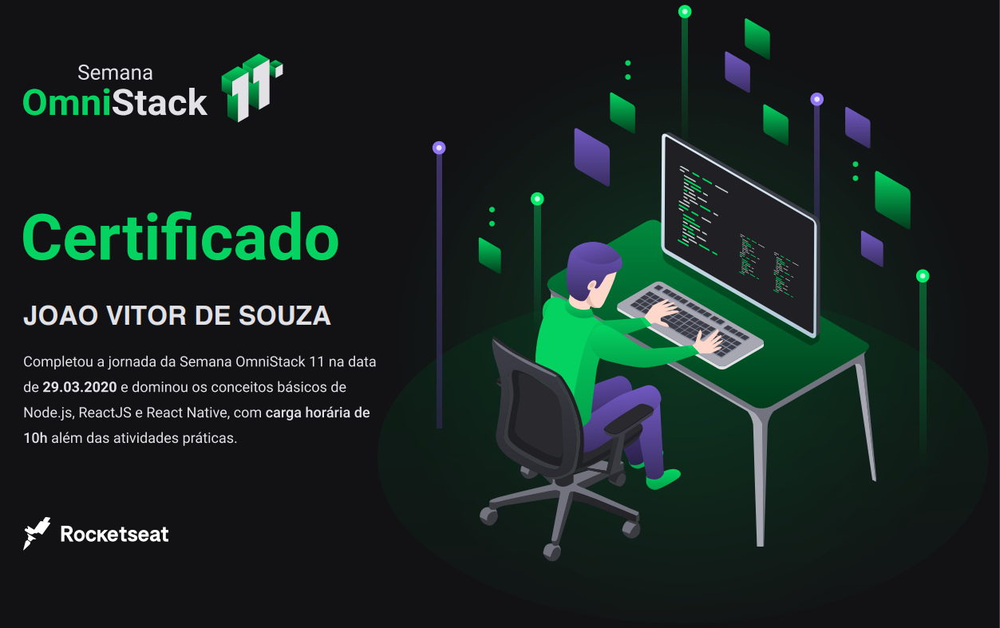

  

#### **Seja um verdadeiro Heroi!** 🦸‍♂️

  
  

## :rocket: Tecnologias usadas

Este projeto foi desenvolvido com as seguintes tecnologias:

### BackEnd

- **[Node.js](https://nodejs.org/en/)**
- **[Express](https://expressjs.com/pt-br/)**
- **[Nodemon](https://www.npmjs.com/package/nodemon)**
- **[Cors](https://www.npmjs.com/package/cors)**

### FrontEnd

## :muscle: Projeto

**Be the Hero** é um projeto que visa ajudar, de maneira **financeira** uma instituição de caridade, ajudando a mesma se manter.

## :mortar_board: Quem ministrou?

A semana foi ministrada pelo **Mestre Jedi** [Diego Fernandes](https://github.com/diego3g). Meu mais sinceros agradecimentos a esse cara e a [Rocketseat](https://rocketseat.com.br), vocês tem feito um papel muito importante para essa comunidade! :rocket:  

## :memo: Licença

Esse projeto está sob a licença MIT. Veja o arquivo [LICENSE](LICENSE.md) para mais detalhes.

# :trophy: Certificado  

Ao fim da semana, foi lançado um questionário avaliando nossos conhecimentos adiquiridos durante a semana, sendo recompensado com um certificado. 

Feito com :blue_heart: by JSouza :wave: [Entre em contato!](https://www.linkedin.com/in/joaovitor-souza/)

